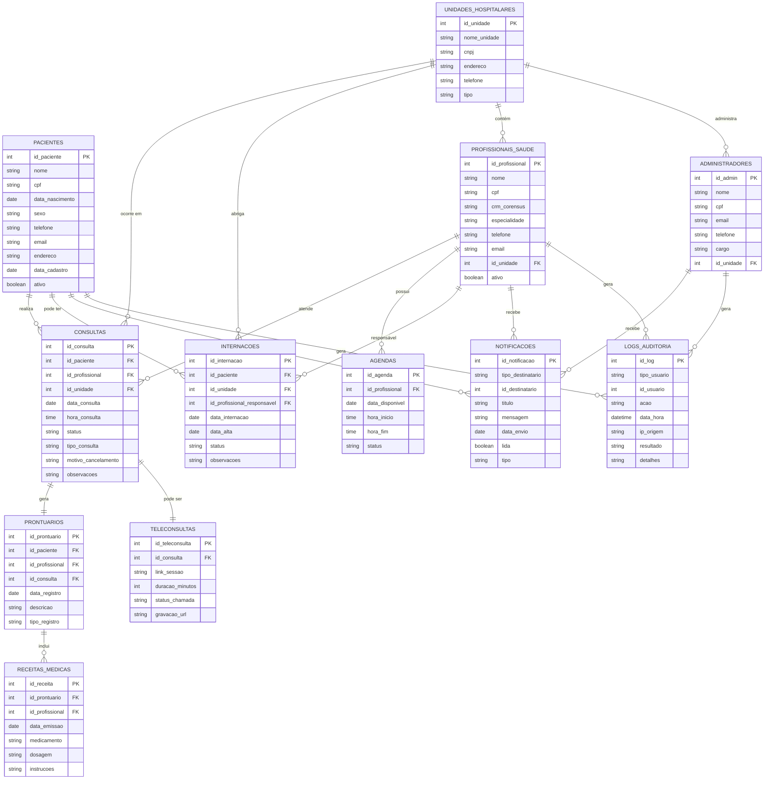

```mermaid
erDiagram
	direction TB
	PACIENTES {
		int id_paciente PK ""  
		string nome  ""  
		string cpf  ""  
		date data_nascimento  ""  
		string sexo  ""  
		string telefone  ""  
		string email  ""  
		string endereco  ""  
		date data_cadastro  ""  
		boolean ativo  ""  
	}

	PROFISSIONAIS_SAUDE {
		int id_profissional PK ""  
		string nome  ""  
		string cpf  ""  
		string crm_corensus  ""  
		string especialidade  ""  
		string telefone  ""  
		string email  ""  
		int id_unidade FK ""  
		boolean ativo  ""  
	}

	ADMINISTRADORES {
		int id_admin PK ""  
		string nome  ""  
		string cpf  ""  
		string email  ""  
		string telefone  ""  
		string cargo  ""  
		int id_unidade FK ""  
	}

	UNIDADES_HOSPITALARES {
		int id_unidade PK ""  
		string nome_unidade  ""  
		string cnpj  ""  
		string endereco  ""  
		string telefone  ""  
		string tipo  ""  
	}

	CONSULTAS {
		int id_consulta PK ""  
		int id_paciente FK ""  
		int id_profissional FK ""  
		int id_unidade FK ""  
		date data_consulta  ""  
		time hora_consulta  ""  
		string status  ""  
		string tipo_consulta  ""  
		string motivo_cancelamento  ""  
		string observacoes  ""  
	}

	AGENDAS {
		int id_agenda PK ""  
		int id_profissional FK ""  
		date data_disponivel  ""  
		time hora_inicio  ""  
		time hora_fim  ""  
		string status  ""  
	}

	PRONTUARIOS {
		int id_prontuario PK ""  
		int id_paciente FK ""  
		int id_profissional FK ""  
		int id_consulta FK ""  
		date data_registro  ""  
		string descricao  ""  
		string tipo_registro  ""  
	}

	RECEITAS_MEDICAS {
		int id_receita PK ""  
		int id_prontuario FK ""  
		int id_profissional FK ""  
		date data_emissao  ""  
		string medicamento  ""  
		string dosagem  ""  
		string instrucoes  ""  
	}

	NOTIFICACOES {
		int id_notificacao PK ""  
		string tipo_destinatario  ""  
		int id_destinatario  ""  
		string titulo  ""  
		string mensagem  ""  
		date data_envio  ""  
		boolean lida  ""  
		string tipo  ""  
	}

	TELECONSULTAS {
		int id_teleconsulta PK ""  
		int id_consulta FK ""  
		string link_sessao  ""  
		int duracao_minutos  ""  
		string status_chamada  ""  
		string gravacao_url  ""  
	}

	INTERNACOES {
		int id_internacao PK ""  
		int id_paciente FK ""  
		int id_unidade FK ""  
		int id_profissional_responsavel FK ""  
		date data_internacao  ""  
		date data_alta  ""  
		string status  ""  
		string observacoes  ""  
	}

	LOGS_AUDITORIA {
		int id_log PK ""  
		string tipo_usuario  ""  
		int id_usuario  ""  
		string acao  ""  
		datetime data_hora  ""  
		string ip_origem  ""  
		string resultado  ""  
		string detalhes  ""  
	}

	PACIENTES||--o{CONSULTAS:"realiza"
	PROFISSIONAIS_SAUDE||--o{CONSULTAS:"atende"
	UNIDADES_HOSPITALARES||--o{CONSULTAS:"ocorre em"
	PROFISSIONAIS_SAUDE||--o{AGENDAS:"possui"
	CONSULTAS||--||PRONTUARIOS:"gera"
	PRONTUARIOS||--o{RECEITAS_MEDICAS:"inclui"
	CONSULTAS||--||TELECONSULTAS:"pode ser"
	PACIENTES||--o{INTERNACOES:"pode ter"
	UNIDADES_HOSPITALARES||--o{INTERNACOES:"abriga"
	PROFISSIONAIS_SAUDE||--o{INTERNACOES:"responsável"
	PACIENTES||--o{NOTIFICACOES:"recebe"
	PROFISSIONAIS_SAUDE||--o{NOTIFICACOES:"recebe"
	ADMINISTRADORES||--o{NOTIFICACOES:"recebe"
	PACIENTES||--o{LOGS_AUDITORIA:"gera"
	PROFISSIONAIS_SAUDE||--o{LOGS_AUDITORIA:"gera"
	ADMINISTRADORES||--o{LOGS_AUDITORIA:"gera"
	UNIDADES_HOSPITALARES||--o{PROFISSIONAIS_SAUDE:"contém"
	UNIDADES_HOSPITALARES||--o{ADMINISTRADORES:"administra"
```